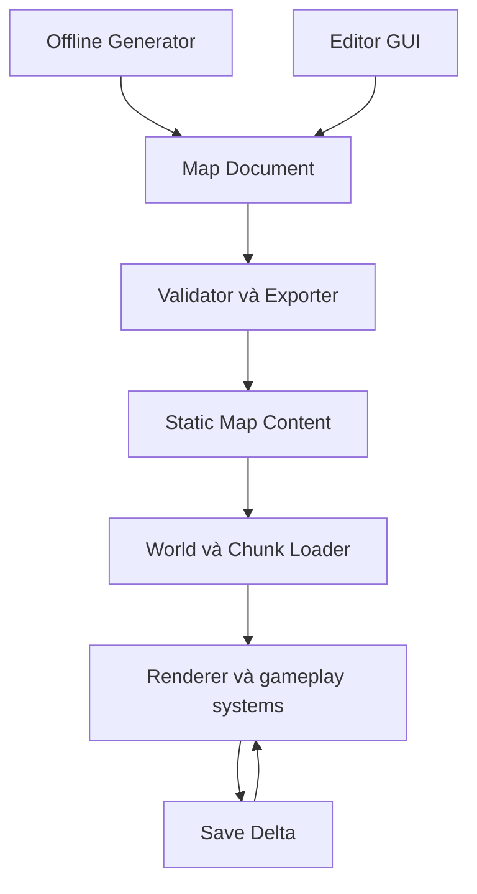

# Kế hoạch triển khai Map Editor — Game zombie React + Three.js

> Tài liệu giao việc cho coding agent. Đọc toàn bộ trước khi triển khai. Đây là bản tổng hợp yêu cầu và thiết kế đề xuất từ trao đổi với chủ dự án; chưa phải kết quả kiểm tra repository.

## 1. Mục tiêu và phạm vi

Xây dựng công cụ GUI riêng để tạo và chỉnh sửa bản đồ cho game sinh tồn zombie trên web, dựa trên kiến trúc **Prefab + Layout JSON theo chunk + Stable ID + Offline Generation**.

Editor tạo dữ liệu map có cấu trúc. Game đọc dữ liệu này để dựng thế giới, kết nối collision, navigation, vision, lighting, loot và tương tác. Runtime không phụ thuộc UI hay state của editor.

Ưu tiên chuyển khu phố hiện tại sang dữ liệu trước, giữ nguyên gameplay và khả năng đọc save cũ, sau đó mới xây GUI. Không cần tái tạo toàn bộ bộ công cụ của Project Zomboid.

### Bối cảnh cần xác minh trong repository

- Stack được mô tả: React + Three.js, Vite; save bằng IndexedDB.
- Gameplay đã có ngày/đêm, melee combat, loot/inventory, zombie AI/navigation, respawn, audio và settings.
- Đề xuất của agent hiện tại gọi bước chuyển dữ liệu là **R3**, với khoảng 3 prefab công trình và layout khu phố hiện có.
- Save **v7** và ID ví dụ `door-safehouse` xuất hiện trong đề xuất. Phải xác minh version, cấu trúc save và ID thực tế trước khi viết migration.
- Không mặc định dự án dùng React Three Fiber chỉ vì có React + Three.js. Kế thừa renderer và state management hiện tại.

### Ngoài phạm vi lần triển khai này

- Không triển khai Threat Director, Base Signature, expedition hay zombie adaptation. Chỉ để chỗ cho metadata thiết kế khi thực sự cần.
- Không xây multiplayer editor, cộng tác thời gian thực, hệ thống mod hoàn chỉnh hay engine ECS mới.
- Không chuyển toàn dự án thành monorepo chỉ để có editor.
- Streaming hoàn chỉnh, nhiều tầng nhà, địa hình độ cao và polygon zones nâng cao là các bước mở rộng; không tự thêm nếu dự án chưa cần.

## 2. Chỉ dẫn thực thi cho agent

1. Đọc `AGENTS.md`, tài liệu kiến trúc, plan refactor và code liên quan trong repository.
2. Xác định phần nào của đề xuất đã tồn tại; tái sử dụng thay vì làm lại.
3. Lập checklist theo các milestone ở mục 13, nêu đường dẫn/module thực tế sẽ sửa.
4. Triển khai tuần tự **M1 → M2 → M3 → M4 → M5 → M6**. M2 phải chứng minh runtime hoạt động với JSON trước khi làm M3.
5. Mỗi milestone phải có kết quả chạy được, kiểm tra phù hợp và báo cáo ngắn. Tiếp tục sang milestone sau khi tiêu chí đạt; chỉ hỏi khi có lựa chọn sản phẩm hoặc nguy cơ mất dữ liệu không thể tự quyết từ code.
6. Các đường dẫn, command và JSON trong tài liệu là hợp đồng đề xuất. Có thể điều chỉnh tên theo repo, nhưng phải giữ các invariant và ghi lại khác biệt.
7. Không tuyên bố đã test nếu chỉ kiểm tra bằng suy luận; ghi rõ kiểm tra đã chạy, chưa chạy và lý do.

## 3. Kiến trúc tổng thể



### Phân chia trách nhiệm

| Thành phần | Trách nhiệm |
| --- | --- |
| Map schema | Kiểu dữ liệu, quy ước tọa độ/ID/version, validation cấu trúc |
| Map compiler/resolver | Resolve prefab, transform tọa độ, tính bounds và tạo descriptor trung lập |
| Runtime adapter | Chuyển descriptor thành entity/render object; đăng ký và gỡ các gameplay system |
| Editor | Asset palette, viewport, inspector, commands, import/export, draft |
| Content tools | Validate, build manifest, generate offline, migration hỗ trợ authoring |
| Save system | Lưu trạng thái thay đổi; không sửa static map gốc |

Editor và runtime dùng chung schema, transform, resolver và asset registry phù hợp. Không sao chép hai bộ quy tắc dựng cửa, collision hay tọa độ khác nhau. Preview có thể tái sử dụng phần render, nhưng không tự khởi chạy AI/combat/loot mutation.

Cấu trúc gợi ý trong repo hiện tại:

```text
src/map/schema/
src/map/shared/
src/map/runtime/
src/map/editor/
content/maps/<worldId>/world.json
content/maps/<worldId>/prefabs/
content/maps/<worldId>/chunks/
content/maps/<worldId>/migrations/
scripts/map-tools/
```

Tách entry/build của editor khỏi game. Bundle game production không được kéo theo toolbar, history, editor-only controls hoặc generator. Các file content được copy/build sang vị trí asset phục vụ runtime theo cấu trúc Vite hiện có.

## 4. Các quyết định nền tảng

### 4.1. Hierarchy và đơn vị

Hierarchy ban đầu: **World → Chunk → Prefab Instance / Standalone Object / Zone / Spawn**. Bên trong prefab có object và metadata phòng/công trình.

- Đơn vị đề xuất: 1 world unit = 1 m; mặt đất trên XZ, Y hướng lên. Nếu code hiện tại dùng quy ước khác, chuẩn hóa qua adapter và tài liệu hóa trước khi đổi.
- Chunk đề xuất: **32 × 32 m**; 64 × 64 m là phương án nếu kích thước công trình và profiling cho thấy phù hợp hơn. Không hard-code kích thước rải rác.
- Grid hiển thị mặc định 1 m; snap có `1`, `0.5`, `0.25` m và `OFF`.
- Prefab xoay theo `quarterTurns: 0 | 1 | 2 | 3` quanh pivot được khai báo.
- Không cần thêm tầng sector/cell nếu chưa có nhu cầu. Có thể nhóm chunk về sau.

Chọn kích thước chunk dựa trên khu phố thực tế. **Không ép cả khu phố vào một chunk 32 m nếu không vừa.** Mục tiêu R3 là 3 prefab và số chunk tối thiểu phù hợp; một chunk chỉ dùng nếu hợp lệ.

### 4.2. Tọa độ và transform

- Instance và object rời lưu vị trí cục bộ so với origin chunk.
- Object trong prefab lưu vị trí cục bộ so với pivot prefab.
- Với chunk `(cx, cz)` và kích thước `S`: origin = `(cx * S, 0, cz * S)`.
- Quy ước `quarterTurns = 1` là phép quay +90° quanh Y; với vector `(x, z)`, kết quả `(z, -x)` theo quy ước này.
- Vị trí thế giới: `chunkOrigin + instancePosition + rotate(localPosition - prefabPivot)`.
- Rotation của object phải compose với rotation của instance; cùng phép transform áp dụng cho collider, cửa, cửa sổ, room, spawn và interaction point.
- Tính chunk bằng `floor(worldX / S)` và `floor(worldZ / S)`, kể cả tọa độ âm.
- Biên chunk dùng khoảng nửa mở: `[origin, origin + S)` để điểm trên biên có một owner rõ ràng.

### 4.3. Công trình vượt biên chunk

Một công trình có thể chạm nhiều chunk nhưng chỉ có **một owner chunk** lưu instance. Các chunk giao với bounds chứa reference/index tới owner, không nhân bản instance và entity.

- Khi chunk lân cận đang hoạt động cần một công trình vượt biên, loader phải resolve và giữ owner/dependency tương ứng.
- Khi hết mọi reference mới được gỡ entity/collision của công trình.
- Tính bounds sau rotation; không chỉ kiểm tra pivot.
- R3 có thể chưa streaming động, nhưng schema và ownership phải tránh tạo object trùng.
- Validation không coi mọi object vượt biên là lỗi. Lỗi là owner/reference không nhất quán hoặc object vượt world bounds không được phép.

## 5. Hợp đồng dữ liệu

Editor chỉ lưu **semantic data**, không serialize `THREE.Scene`, `Mesh`, `Geometry`, `Material`, runtime handle hoặc callback.

Các ví dụ dưới đây là trích đoạn minh họa định dạng, không phải bộ map hoàn chỉnh để chạy trực tiếp.

### 5.1. World manifest

`world.json` đồng thời là manifest ban đầu; không cần thêm `manifest.json` trùng trách nhiệm.

```json
{
  "schemaVersion": 1,
  "worldId": "zombie-town",
  "contentVersion": 1,
  "chunkSize": 32,
  "coordinateSystem": "y-up-xz-meters",
  "chunkBounds": { "minCx": 0, "maxCx": 1, "minCz": 0, "maxCz": 0 },
  "chunks": [
    { "chunkId": "c0_0", "cx": 0, "cz": 0, "path": "chunks/c0_0.json" },
    { "chunkId": "c1_0", "cx": 1, "cz": 0, "path": "chunks/c1_0.json" }
  ],
  "prefabs": [
    { "prefabId": "house/suburban_01", "contentVersion": 1, "path": "prefabs/suburban_01.json" }
  ],
  "spawnPoints": [
    { "spawnId": "start-safehouse", "chunkId": "c0_0", "localSpawnId": "player-start" }
  ]
}
```

Manifest phải liệt kê chunk và prefab thực sự tồn tại cùng đường dẫn tương đối. Bounds không thay thế index. Chốt rõ min/max chunk index có bao gồm biên; ví dụ này dùng cả min và max.

### 5.2. Prefab

```json
{
  "schemaVersion": 1,
  "prefabId": "house/suburban_01",
  "contentVersion": 1,
  "pivot": { "x": 0, "y": 0, "z": 0 },
  "footprint": { "minX": 0, "minZ": 0, "maxX": 9, "maxZ": 7 },
  "objects": [
    {
      "localId": "door-front",
      "kind": "door",
      "assetId": "door/wood_01",
      "position": { "x": 4, "y": 0, "z": 0 },
      "quarterTurns": 0,
      "properties": { "locked": false, "health": 100 }
    },
    {
      "localId": "kitchen-cabinet-01",
      "kind": "container",
      "assetId": "furniture/cabinet_01",
      "position": { "x": 2, "y": 0, "z": 2 },
      "quarterTurns": 0,
      "properties": {
        "containerType": "cabinet",
        "lootTableId": "residential.kitchen",
        "capacity": 20,
        "roomId": "kitchen"
      }
    }
  ],
  "rooms": [
    {
      "localId": "kitchen",
      "roomType": "kitchen",
      "bounds": { "minX": 0, "minZ": 0, "maxX": 5, "maxZ": 3 },
      "floorY": 0,
      "height": 3
    }
  ]
}
```

Schema cần hỗ trợ footprint, tường, cửa, cửa sổ, nội thất, container slot/loot table, đèn, room và interaction point theo capability hiện có. Dùng discriminated union theo `kind`, kiểm tra `properties` theo từng loại; không biến schema thành túi `any`.

Asset registry ánh xạ `assetId` sang hình ảnh/model và thông tin mặc định cần thiết. Chốt một nguồn sở hữu collision/occlusion mặc định, cùng quy tắc override rõ ràng; tránh lưu hai bản collider mâu thuẫn.

### 5.3. Chunk layout

```json
{
  "schemaVersion": 1,
  "contentVersion": 1,
  "chunkId": "c0_0",
  "cx": 0,
  "cz": 0,
  "instances": [
    {
      "instanceId": "house-3",
      "prefabId": "house/suburban_01",
      "position": { "x": 12, "y": 0, "z": 8 },
      "quarterTurns": 1
    }
  ],
  "terrain": [],
  "roads": [],
  "objects": [],
  "zones": [
    {
      "zoneId": "zombie-zone-4",
      "kind": "zombiePopulation",
      "shape": "rectangle",
      "bounds": { "minX": 2, "minZ": 18, "maxX": 28, "maxZ": 30 },
      "properties": { "populationMin": 8, "populationMax": 22 }
    }
  ],
  "spawns": [
    {
      "spawnId": "player-start",
      "kind": "player",
      "position": { "x": 4, "y": 0, "z": 4 },
      "quarterTurns": 0
    }
  ],
  "externalInstanceRefs": []
}
```

Định nghĩa `terrain` và `roads` theo cách ground/road hiện tại đang được biểu diễn. Không bắt buộc đổi toàn bộ sang tile terrain nếu không cần. Các mảng trống trong ví dụ không có nghĩa được bỏ qua nội dung hiện hữu khi migrate.

### 5.4. Static content và runtime state

| Static map/editor | Runtime/save |
| --- | --- |
| Loại container, capacity, loot table | Đồ đã sinh, đồ còn lại, cờ đã loot |
| Máu cửa mặc định, lock mặc định | Cửa đã mở, hư hại hoặc bị phá |
| Population ban đầu, loại zone | Zombie đang tồn tại, respawn timer |
| Spawn point, room bounds | Vị trí player, trạng thái nhân vật |
| Tham số Threat nếu bổ sung sau | Threat hiện tại, noise history, migration pressure |

Không export trạng thái simulation đang chạy vào map gốc. Room/indoor metadata phục vụ các system nhưng không được tự làm tối ánh sáng môi trường vì player không nhìn thấy khu vực đó.

## 6. Stable ID, version và migration save

### 6.1. Quy tắc ID

Giữ format agent đề xuất cho object trong prefab:

```text
<identityChunkId>/<instanceId>/<localId>
c0_0/house-3/door-front
```

Trong save, đặt các ID này dưới namespace `worldId`. Object rời, zone và spawn cần namespace riêng, ví dụ `c0_0/objects/tree-17`, `c0_0/zones/zombie-zone-4`, `c0_0/spawns/player-start`.

- ID không sinh từ index mảng, vị trí hiện tại, tên hiển thị hoặc timestamp mỗi lần export.
- Đổi tên hiển thị, xoay và di chuyển trong cùng chunk không đổi ID.
- Duplicate tạo identity mới; undo delete phục hồi identity cũ; redo đặt lại đúng identity của command.
- Không tái sử dụng ID của object đã xóa cho object có ý nghĩa khác.
- `localId` ổn định qua các lần sửa prefab. ID dùng trong reference phải được kiểm tra tính duy nhất và ký tự phân cách.

**Điểm cần sửa trong đề xuất ban đầu:** ID chứa chunk sẽ không tự ổn định nếu instance bị chuyển sang chunk khác. MVP phải phát hiện và chặn việc re-home âm thầm đối với content đã phát hành. Khi bổ sung di chuyển liên chunk, chọn và triển khai rõ một trong hai cách:

1. Giữ identity prefix bất biến, tách khỏi `ownerChunkId` vật lý và có index tra cứu; hoặc
2. Đổi ID bằng migration tường minh từ ID cũ sang ID mới, kèm cập nhật mọi reference và save.

Không âm thầm đổi cả mô hình ID ở R3 nếu ID có cấu trúc đã tồn tại trong repo. Ghi quyết định vào tài liệu kiến trúc.

### 6.2. Phân biệt version

| Trường | Ý nghĩa |
| --- | --- |
| `schemaVersion` | Cấu trúc JSON của map |
| `contentVersion` | Revision nội dung world/chunk/prefab |
| `saveVersion` | Cấu trúc dữ liệu save |
| Generator metadata | Seed, generator version và catalog version khi có worldgen |

`contentVersion` chỉ giúp phát hiện khác biệt, **không tự giải quyết migration**. Save phải biết world/content mà nó được tạo từ đó; content không tương thích phải có migration hoặc báo lỗi rõ ràng.

### 6.3. Migration R3

1. Kiểm kê đầy đủ ID cũ: cửa, container, object có state, zombie/spawn/respawn state nếu đang được persist.
2. Tạo mapping theo version, ví dụ `door-safehouse → c0_0/safehouse-1/door-front`; đây là ví dụ, phải dùng ID thật.
3. Kiểm tra mapping không nhiều ID cũ va vào một ID mới ngoài trường hợp được xử lý tường minh.
4. Migrate trên bản sao; validate xong mới ghi save mới bằng transaction phù hợp, giữ bản gốc/backup để phục hồi.
5. Migration chỉ chạy cho version nguồn phù hợp, có tính idempotent; không remap lại mỗi lần load.
6. Unknown/orphan delta phải được báo cáo và giữ để xử lý, không xóa im lặng.
7. Container đã loot, cửa đã phá, timer và dynamic entity không được reset chỉ vì chunk unload/reload hoặc content đổi.
8. Loại bỏ các hằng `*_ADDED_Vn` chỉ sau khi đã có migration/content rule thay thế tương đương.

Ví dụ delta:

```json
{
  "worldId": "zombie-town",
  "contentVersion": 1,
  "objectDeltas": {
    "c0_0/house-3/door-front": { "open": true, "locked": false, "health": 47 }
  },
  "removedObjectIds": []
}
```

Đây chỉ là phần map trong save. Không thay thế các dữ liệu player, inventory, time, settings hoặc zombie state hiện có.

## 7. Runtime loading và lifecycle

Pipeline bắt buộc:

1. Load và validate world manifest; tra index để tìm đúng content.
2. Load chunk và prefab dependencies; validate reference/version.
3. Resolve prefab thành descriptor với ID và world transform.
4. Áp dụng save delta/tombstone trước khi entity bắt đầu tương tác hoặc AI hoạt động.
5. Đăng ký renderer, collision, interaction, container, room/lighting, vision occluder và navigation theo adapter hiện hữu.
6. Khi gỡ chunk: lưu/giữ dirty runtime state, hủy đăng ký đầy đủ, giải phóng tài nguyên do chunk sở hữu.

Không dispose geometry/material/texture dùng chung khi chunk khác còn sử dụng. Không tạo loot lại hoặc respawn lại ngoài luật gameplay hiện có. Entity động như zombie vượt chunk cần giữ identity runtime và chuyển ownership; không suy ID từ vị trí mới.

M2 cho phép load toàn bộ khu phố một lần qua loader mới. Chưa cần triển khai streaming radius ngay. Nhưng loader phải có lifecycle và tránh double registration để mở rộng sau này.

## 8. Editor Core và UX

### 8.1. Bố cục

| Vùng UI | Nội dung |
| --- | --- |
| Thanh trên | New/Open, Save Draft, Import/Export, Validate, Play |
| Bên trái | Asset/prefab palette, search, categories |
| Trung tâm | Viewport Three.js, grid, selection và placement preview |
| Bên phải | Inspector: ID, prefab, position, rotation, properties |
| Panel phụ | Layers, chunk status, validation results |

Camera có top-down/orthographic phục vụ đặt đồ, cùng góc isometric nếu renderer hiện tại hỗ trợ. Có pan, zoom, focus selection. Không chạy player movement khi đang dùng camera editor.

### 8.2. Tool MVP

- Select: pick đúng object/instance; ignore hidden/locked layer.
- Place Prefab: ghost preview, snap, xoay 90°, xác nhận/hủy.
- Move: drag hoặc sửa tọa độ trong inspector; preview trước khi commit.
- Rotate: 0°, 90°, 180°, 270°.
- Delete: xóa selection qua command; undo phục hồi đầy đủ.
- Duplicate: identity mới; có thể bổ sung cuối M3.
- Import/Export, Undo/Redo và validation cơ bản phải có ngay M3.

### 8.3. State và command history

Tách `MapDocument` có thể serialize, `EditorSession` tạm thời (camera, selection, tool, visibility) và render objects được suy ra từ document.

- Document là nguồn dữ liệu chính; Three.js scene không phải nơi lưu state map.
- React quản lý UI và session/document qua cơ chế phù hợp dự án; không `setState` toàn scene mỗi frame.
- Command tối thiểu: Place, Move, Rotate, Delete, UpdateProperties; bổ sung Zone/Spawn/PrefabEdit tương ứng.
- Một lần drag là một history entry; inspector thay đổi qua cùng command system.
- Undo/Redo phải khôi phục cả data, selection liên quan và identity; clear redo khi có command mới sau undo.
- Hotkey chỉ hoạt động đúng context, không chặn nhập văn bản trong input.
- Có dirty indicator và cảnh báo khi đóng/chuyển document còn thay đổi chưa lưu.

### 8.4. Lưu và nhập dữ liệu trên browser

- Save Draft lưu bản nháp vào IndexedDB namespace riêng cho editor.
- Export tạo content pack JSON/ZIP theo manifest; Import đọc lại pack bằng file picker. Chọn cách đóng gói đơn giản phù hợp dependency hiện có.
- Không hứa browser tự ghi trực tiếp vào `src/` hoặc `public/`. Nếu bổ sung dev-only filesystem bridge sau này, phải tách rõ khỏi production.
- Import parse/validate trước, lỗi không được thay thế document đang mở.
- Round-trip export → import phải giữ ID, transform, metadata và reference.
- Export có thứ tự ổn định, dễ review diff; không trộn camera, selection hay timestamp biến động vào static content không cần thiết.

## 9. World Authoring, layer và zone

M4 bổ sung đặt props, nền/đường theo schema đã chọn, rectangle zones và spawn point. Các layer khởi đầu gồm Terrain, Road, Building, Props, Containers, Zones, Zombie và Spawn; thêm Furniture/Collision/Navigation/Debug khi có dữ liệu tương ứng.

Visibility và lock của editor không tự làm object biến mất trong game. Gameplay enabled/disabled là property khác.

Hiển thị chunk boundary, chunk coordinate và trạng thái loaded/modified/invalid. Khi zoom xa, có thể giảm chi tiết nhưng vẫn thấy extent world và selection.

Zone MVP: `zombiePopulation`, `safeSpawn`, `residential`, `commercial`, `forest`, `event` theo nhu cầu runtime. Chỉ loại đã có consumer mới được quảng bá là có tác dụng gameplay; metadata còn lại phải ghi rõ chưa được sử dụng.

MVP có thể giới hạn zone trong một chunk. Zone xuyên chunk về sau cần identity và ownership riêng; không nhân bản population khi cắt zone thành nhiều phần. Chốt quy tắc khi zone chồng nhau, chẳng hạn priority theo loại, và validate trường hợp nhập nhằng.

## 10. Prefab Editor

M5 thêm chế độ chỉnh prefab trong hệ tọa độ cục bộ:

- Đặt/chỉnh tường, cửa, cửa sổ, furniture, container, light, room và interaction point.
- Inspector container có type, loot table, capacity và local ID.
- Vẽ room rectangle trước; polygon/multi-floor làm sau nếu cần.
- Preview orientation, footprint, collision, cửa ra vào và interaction reach.
- Khi mở prefab từ instance, hiển thị rõ đang sửa prefab gốc và những instance nào bị ảnh hưởng.
- Duplicate prefab tạo `prefabId` mới; chỉnh model thông qua asset registry khi đúng bản chất thay đổi.
- Xóa/đổi `localId` có state phải cảnh báo về migration. Sửa hình ảnh không được reset trạng thái container/cửa đã lưu.

MVP không cần arbitrary per-instance override hoặc nested prefab. Nếu cần biến thể nhà, bắt đầu bằng prefab variant rõ ràng để hạn chế độ phức tạp của merge và migration.

## 11. Validation và Play From Here

### 11.1. Validation

Validator dùng chung cho editor, command line và runtime ở mức phù hợp. Trả về severity, code, message, document path và entity ID để click tới lỗi.

| Chặn export/play | Cảnh báo thiết kế |
| --- | --- |
| Schema sai, số không hữu hạn, rotation không hợp lệ | Công trình không có cửa vào |
| ID trùng hoặc reference không tồn tại | Collider/công trình chồng lấn đáng ngờ |
| Prefab/asset/loot table chưa được đăng ký | Container ngoài room được gán |
| Owner và chunk reference không nhất quán | Zone có thể quá dày hoặc khó tiếp cận |
| Spawn bắt đầu bị chặn theo collision thực tế | Room/navigation disconnected nếu có bộ kiểm tra tương ứng |
| Unsupported schema/content migration | Nội dung nằm ngoài vùng chơi dự kiến |

M1/M2 cần validation schema, ID, reference và transform. M3 có Validate UI. Validation hình học/nav nâng cao có thể hoàn thiện M6; không hứa kiểm tra reachability khi chưa có dữ liệu navigation phù hợp.

### 11.2. Play From Here

- Chọn điểm hợp lệ trong viewport → tạo snapshot bất biến → validate → chạy qua runtime loader thật.
- Dùng test save/IndexedDB namespace riêng hoặc memory store; tuyệt đối không ghi vào save người chơi hiện có.
- Quay lại editor giữ nguyên document, selection và camera; play session không sửa map gốc.
- Nếu asset/content thiếu, hiển thị lỗi rõ ràng; không fallback âm thầm sang map mặc định rồi báo test thành công.
- Kiểm tra được cửa, loot, collision, LOS, ánh sáng ngày/đêm và zombie navigation bằng chính gameplay systems hiện có.

## 12. Offline generator và công cụ sản xuất

M6 mới bổ sung generator tối thiểu. Generator là producer của cùng schema, không có format riêng.

Pipeline dự kiến: seed → bố trí đường/lô đất → chọn và đặt prefab → props/vegetation → zones/spawns → validate → content pack → chỉnh tay trong editor.

- Cùng seed **và cùng generator/catalog/config version** phải cho cùng output chuẩn hóa.
- PRNG và thứ tự duyệt ổn định; không phụ thuộc `Math.random()`, thời gian chạy hoặc thứ tự filesystem không được chuẩn hóa.
- Sinh ID ổn định trong output. Bản đồ đã sửa tay không bị ghi đè khi chạy generator lần nữa.
- Regenerate tạo output/document riêng; merge vào world đã phát hành là việc riêng có diff và migration nếu cần.
- Runtime tải JSON đã xuất, không regenerate toàn world khi người chơi vào game.
- Metadata generator phục vụ truy vết; việc có seed không thay thế static content và save delta.

Asset palette nâng cao có thumbnail, tìm kiếm và nhóm Buildings, Furniture, Nature, Props. Thumbnail/cache không phải điều kiện chặn migration hoặc editor MVP.

## 13. Milestone và tiêu chí nghiệm thu

### M1 — Audit và Map Schema

**Việc làm:** khảo sát data flow hiện tại; chốt schema, coordinates, pivot, ownership, ID/version; tạo validator/resolver thuần và fixtures nhỏ.

**Hoàn thành khi:**

- [ ] Có bản đồ module hiện tại và danh sách hard-coded content cần chuyển.
- [ ] Có schema/runtime validation và tài liệu quy ước.
- [ ] Transform 4 rotation đúng cho mesh descriptor, collider, room và interaction point.
- [ ] Tọa độ âm/biên chunk có owner nhất quán.
- [ ] Đã chốt cách xử lý ID khi đổi owner chunk.

### M2 — Runtime Migration / R3

**Việc làm:** trích công trình hiện tại thành khoảng 3 prefab, tạo chunk layout và manifest, kết nối loader/adapters, migrate save cũ bằng mapping.

**Hoàn thành khi:**

- [ ] Khu phố được nạp từ JSON, giữ bố trí và gameplay như trước.
- [ ] Không còn hai nguồn cùng tạo một công trình/container.
- [ ] Cửa, collision, nav/AI, LOS, day/night, loot, combat và respawn không bị regression quan sát được.
- [ ] Save fixture trước migration load được; inventory, đồ đã loot, trạng thái cửa và các state hiện có được bảo toàn.
- [ ] Save mới load lại đúng; migration không chạy lặp, có đường phục hồi khi lỗi.
- [ ] Load/unload nếu đã hỗ trợ không làm nhân đôi entity hoặc reset loot.

**Gate:** chưa đạt M2 thì sửa adapter/schema/migration trước khi xây GUI.

### M3 — Editor Core MVP

**Việc làm:** entry riêng, viewport, palette, select/move/rotate/place/delete, inspector, snapping, commands, undo/redo, drafts, import/export và validation UI cơ bản.

**Hoàn thành khi:**

- [ ] Tạo layout bằng GUI với prefab đã migrate.
- [ ] Export → import giữ nguyên ID và metadata.
- [ ] Runtime load được chính output của editor.
- [ ] Undo/redo hoạt động cho mọi thao tác sửa document của MVP.
- [ ] Editor draft và game save độc lập.
- [ ] Bundle game không chứa editor UI và generator.

### M4 — World Authoring

**Việc làm:** nhiều chunk, boundary/status, layer hide/lock, props, nền/đường, rectangle zone và spawn.

**Hoàn thành khi:**

- [ ] Tạo và mở được map có ít nhất hai chunk liền nhau.
- [ ] Công trình vượt biên có một owner, không trùng entity; dependency đúng nếu có streaming.
- [ ] Spawn/zone hợp lệ nối được với system runtime tương ứng.
- [ ] Pick/snap/lock layer đúng; kéo liên chunk tuân thủ chính sách identity.

### M5 — Prefab Editor

**Việc làm:** chỉnh cấu trúc nhà, nội thất, container, room, đèn và interaction metadata theo capability hiện tại.

**Hoàn thành khi:**

- [ ] Tạo một prefab nhà mới hoàn toàn từ GUI, đặt được trong world và chơi được.
- [ ] Cửa/collision, loot và room metadata hoạt động ở cả bốn rotation.
- [ ] Sửa prefab giữ local ID và state đã persist khi thay đổi tương thích.
- [ ] UI phân biệt sửa prefab gốc với di chuyển instance.

### M6 — Production Tools

**Việc làm:** Play From Here, validation nâng cao, CLI content check/build, generator offline tối thiểu và thumbnails.

**Hoàn thành khi:**

- [ ] Test play không sửa map/draft và không chạm save thật.
- [ ] Generator lặp lại cho output giống nhau với cùng bộ input/version.
- [ ] Generated map mở được, chỉnh tay được và runtime load được.
- [ ] Có hướng dẫn tạo prefab → đặt map → validate → export → play.
- [ ] Có báo cáo performance cùng giới hạn thực tế và các phần deferred.

## 14. Kiểm thử cần tập trung

Ưu tiên test bảo vệ dữ liệu và ranh giới kiến trúc; không cần viết test mô phỏng lại mọi setter hay mọi nút UI.

| Nhóm | Tình huống quan trọng |
| --- | --- |
| Transform | Bốn góc xoay; pivot không ở origin; điểm/collider/door đồng bộ |
| Ownership | Tọa độ âm; nằm đúng biên; nhà vượt hai chunk; load/unload lặp |
| Identity | Move/rotate giữ ID; duplicate ID mới; undo/redo giữ identity đúng |
| Save migration | Save thật/fixture version cũ; container đã loot; cửa bị phá; lỗi migration giữ bản gốc |
| Version/content | Thiếu prefab, sai version, local ID bị xóa; không reset state im lặng |
| Round-trip | Export/import bảo toàn document; invalid import không phá bản đang mở |
| Integration | JSON do editor tạo đi qua runtime loader thật; không code path dựng map thứ hai |
| Isolation | Test play/draft tách game save; AI không chạy trong authoring preview |
| Generator | Output ổn định với cùng input và không ghi đè bản chỉnh tay |

Đo baseline trước M2 và so sánh trên cùng map, máy, settings: thời gian load, số entity/draw calls, frame time và memory sau load/unload. Chốt budget theo kết quả thực tế; không tự cam kết 60 FPS hay world vô hạn khi chưa đo.

## 15. Những điều agent không được làm

- Bắt đầu GUI trước khi runtime đọc được schema mới.
- Serialize scene Three.js làm định dạng map chính.
- Giữ collision/nav/vision/loot của map mới ở nhiều nhánh hard-code riêng.
- Lấy vị trí hoặc array index làm identity của object có save state.
- Reset save/loot để che lỗi migration.
- Dùng `contentVersion` như bằng chứng tự động tương thích save.
- Nhân bản cùng công trình ở nhiều chunk để giải quyết vượt biên.
- Bỏ undo/redo và validation cơ bản tới cuối dự án.
- Cho editor visibility thay đổi ánh sáng môi trường hoặc gameplay state.
- Chạy worldgen nặng trong runtime hoặc đưa editor/generator vào bundle game.
- Dùng Play From Here trên save thật.
- Mở rộng scope sang gameplay mới trước khi pipeline authoring hoạt động.

## 16. Bàn giao và báo cáo tiến độ

Sau mỗi milestone, báo cáo:

1. Hành vi đã đạt và module/file chính đã thay đổi.
2. Những điều chỉnh so với tài liệu, cùng lý do từ code thực tế.
3. Lệnh kiểm tra đã chạy và kết quả; manual checks nếu có.
4. Trạng thái save compatibility, hạn chế còn lại và milestone tiếp theo.

Bàn giao cuối gồm schema, content khu phố đã migrate, migration mappings, runtime loader/adapters, editor, công cụ validate/export và hướng dẫn sử dụng. Generator/advanced tools chỉ được đánh dấu hoàn thành khi đã chạy và kiểm chứng.

**Bắt đầu ngay bằng M1:** kiểm tra repository, xác định nguồn tạo map và hệ thống save hiện tại, rồi chốt hợp đồng dữ liệu trước khi sửa runtime. Mục tiêu đầu tiên là khu phố hiện tại chạy bằng Prefab + Chunk JSON với gameplay và save được bảo toàn.
