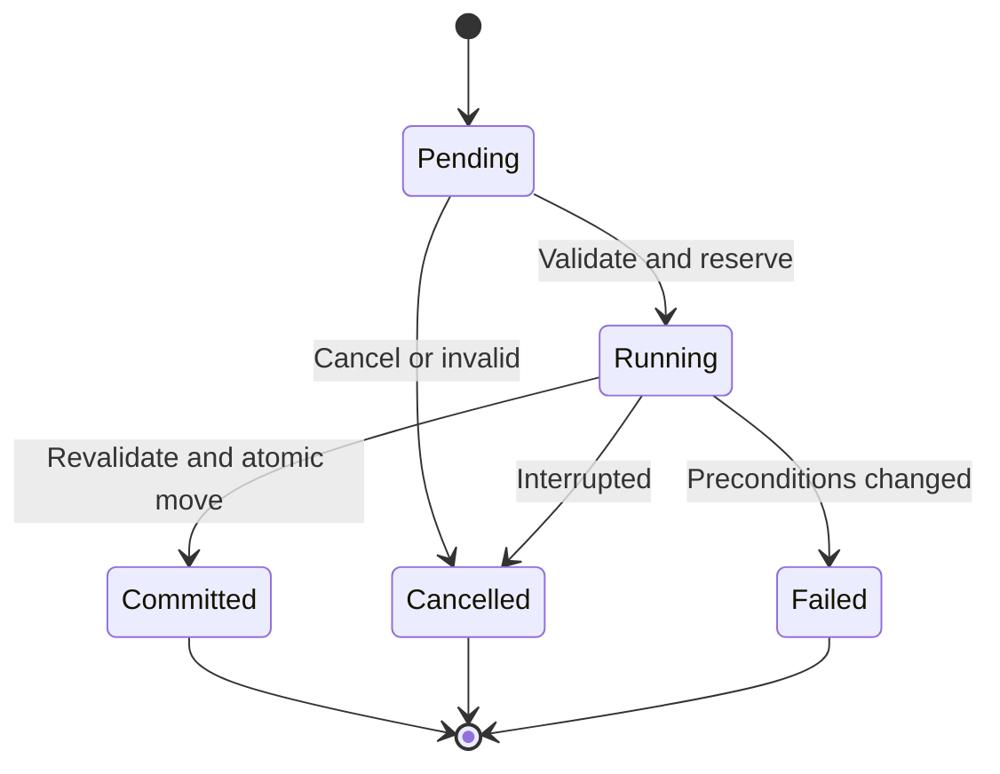

# PHASE — Nâng cấp hoàn chỉnh Inventory & Loot

> Dành cho coding agent triển khai trực tiếp vào game sinh tồn zombie React + Three.js.
> Ngày soạn: 28/09/2026. Mã phase: `INV-LOOT`. Không gán số phase để tránh xung đột roadmap hiện có.
> Đây là đặc tả thiết kế cho dự án, lấy cảm hứng từ cảm giác sử dụng Project Zomboid; không phải tài liệu mô tả chính xác mã nguồn hoặc mọi cơ chế của PZ.

## 1. Nhiệm vụ của agent

Bạn đóng vai senior gameplay/UI engineer. Hãy khảo sát codebase, lập kế hoạch theo các sprint bên dưới và triển khai toàn bộ phase thành chức năng chạy được trong game hiện tại. Không dừng ở mockup, dữ liệu giả, component rời hoặc bản mô tả kiến trúc.

Đọc `AGENTS.md`, tài liệu kiến trúc, roadmap và quy ước của repository trước khi sửa. Tận dụng hệ thống hiện có; tên module, kiểu dữ liệu và đường dẫn trong tài liệu này mang tính định hướng, phải thích nghi với codebase. Không tạo store hoặc action queue thứ hai nếu dự án đã có thành phần tương đương.

Thực hiện các quyết định triển khai thông thường mà không yêu cầu xác nhận từng bước. Chỉ hỏi khi có xung đột yêu cầu thực sự hoặc cần thay đổi phá hủy dữ liệu mà không thể bảo toàn. Không tự viết lại toàn bộ game, đổi framework, nâng major dependency, thay hệ thống render hoặc thay cân bằng gameplay ngoài phạm vi phase.

### 1.1 Bối cảnh đã biết — cần đối chiếu với repository

- Stack: React, Three.js, Vite; lưu game bằng IndexedDB.
- Game đã có ngày/đêm, combat melee, zombie AI/respawn, âm thanh và settings.
- Inventory được mô tả trước đây là 12 slot; có đồ hộp, nước, snack, băng gạc, hộp cứu thương, nước tăng lực.
- Roadmap có container loot, nhiều vũ khí melee, durability/repair, tài nguyên gỗ/kim loại/băng keo và túi đeo.
- Trạng thái thực tế của các tính năng roadmap chưa được xác minh trong tài liệu này. Agent phải kiểm tra, không giả định tất cả đã tồn tại.

### 1.2 Kết quả người chơi phải nhận được

Người chơi tiếp cận tủ → mở Loot → duyệt danh sách đồ → xem tooltip → chuyển một món, nhiều món hoặc tất cả vào túi → thấy tiến trình → có thể hủy hoặc bị gián đoạn → sử dụng/trang bị/bỏ đồ → save/load giữ nguyên kết quả.

Toàn bộ trải nghiệm diễn ra trong thế giới đang chạy. UI phải mang cảm giác công cụ sinh tồn thực dụng: bảng dữ liệu nhỏ gọn, hai cửa sổ độc lập, icon vật phẩm, nền tối trong suốt, thao tác chuột nhanh.

## 2. Phạm vi và quyết định mặc định

### 2.1 Bắt buộc hoàn thành trong phase

1. Inventory và Loot dạng danh sách, kéo vị trí, resize, thu gọn, ghim, đóng/mở độc lập.
2. Inventory chính, backpack/túi trang bị, container gần nhân vật và đồ dưới đất.
3. Chọn nhiều, lọc, tìm kiếm, sort, nhóm đồ tương tự, tooltip và menu chuột phải.
4. Kéo thả, double-click, Take/Store/Take All, chọn số lượng, Drop.
5. Domain model rõ ràng cho item definition, item instance, inventory/container và equipment.
6. Action queue có thời gian thực hiện, kiểm tra điều kiện, hủy và commit an toàn.
7. Container loot sinh một lần, lưu bền vững; có loot table theo loại container.
8. Save/load và migration bảo toàn inventory cũ.
9. Tích hợp input, combat, item use, equipment và durability hiện có.
10. Kiểm thử logic có rủi ro, kiểm tra UI trực tiếp và bàn giao ảnh chụp gameplay thật.

### 2.2 Không mở rộng trong phase

- Multiplayer/server authority, networking hoặc chống gian lận mạng.
- Grid kiểu Tetris, rarity màu tím/vàng, stat affix ngẫu nhiên.
- Toàn bộ hệ thống crafting/building, dinh dưỡng hay hỏng thực phẩm mới.
- Ba lô lồng ba lô hoặc túi vô hạn tầng.
- Tự thêm encumbrance penalty hoặc hard weight limit mới.
- Viết lại vision, ánh sáng ngày/đêm, AI zombie hoặc combat core.

### 2.3 Quyết định về slot và trọng lượng

| Chủ đề | Quyết định mặc định |
|---|---|
| Main inventory | Giữ 12 slot nếu codebase vẫn dùng giới hạn này |
| Stack limit | Tái sử dụng giới hạn hiện có; bổ sung vào item registry nếu đang hardcode |
| Slot sử dụng | Một stack thật chiếm một slot; một item không stack chiếm một slot |
| Nhóm hiển thị | Không làm thay đổi slot hoặc gộp instance trong dữ liệu |
| Trọng lượng | Tính và hiển thị khối lượng thực; chưa dùng làm giới hạn mới |
| Túi trang bị | Inventory riêng; nếu chưa có, thêm một backpack mẫu 8 slot, cấu hình bằng data |
| Túi có đồ | Khối lượng túi = vỏ túi + toàn bộ đồ bên trong; chưa có weight reduction |
| Quá tải từ save cũ | Giữ đồ, đánh dấu overcapacity, cho lấy ra nhưng chặn việc làm tăng số slot vượt giới hạn |

Nếu repository đã có cơ chế trọng lượng hoàn chỉnh, giữ luật hiện tại và ghi rõ trong audit. Không tự quay về slot-only. Cảnh báo quá tải chỉ xuất hiện khi một giới hạn đang thực sự được enforce; không tô đỏ khối lượng chỉ để trang trí.

## 3. Sprint 0 — Khảo sát và khóa phương án tích hợp

Trước khi code, lập bản đồ ngắn của các phần sau, dùng đường dẫn thực trong repo:

- Item registry, item ID, cách biểu diễn stack/quantity/condition.
- Player inventory, equipment, hotbar và nơi xử lý item use.
- World entity ID, map/chunk, container, world drop, zombie corpse nếu có.
- Game loop, pause, input manager, pointer lock, raycast tương tác.
- Action queue/timed action, damage/death events, âm thanh.
- Save schema, IndexedDB database/store/version, autosave, new game/reset.
- State management React và cách UI đang nhận cập nhật từ game.
- Các script build/lint/test và runtime được repo yêu cầu.

**Đầu ra:** tài liệu audit ngắn, danh sách module giữ lại/mở rộng/thay thế, rủi ro migration, danh sách file dự kiến sửa. Nếu chỉ có loot nhặt trực tiếp, giữ nó dưới dạng adapter vào cùng transfer API trong thời gian chuyển đổi.

**Gate:** xác định được một nguồn dữ liệu authoritative và một nơi duy nhất thực thi thay đổi ownership/quantity. Không bắt đầu UI với state item riêng tách khỏi gameplay.

## 4. Đặc tả thị giác và bố cục

### 4.1 Hướng thiết kế

- Gần PZ ở cấu trúc danh sách, mật độ thông tin, cửa sổ tiện dụng và tương tác container.
- Nền than chì trong suốt, viền 1px, góc vuông hoặc bo tối đa 2px, bóng đổ nhẹ.
- Tránh card lớn, khoảng trắng rộng, glow/neon, gradient bóng bẩy và hiệu ứng sci-fi.
- Dùng icon vật phẩm do dự án sở hữu hoặc asset có quyền sử dụng; không phụ thuộc vào việc trích xuất asset PZ.
- Icon 2D/pixel hoặc painted low-detail có màu, silhouette rõ ở 20–24px. Nếu thiếu asset, dùng placeholder nhất quán và lập danh sách thay thế; chức năng phải hoàn chỉnh.
- Tất cả label lấy từ một nơi tập trung, tái sử dụng i18n hiện có. Có thể dùng label tiếng Anh cho phong cách, nhưng không trộn ngôn ngữ tùy tiện trong cùng UI.

### 4.2 Token đề xuất

```css
--inv-bg: rgba(25, 28, 29, 0.93);
--inv-header-bg: #272b29;
--inv-border: #555b55;
--inv-text: #e2dfd4;
--inv-muted: #a9ada2;
--inv-hover: rgba(180, 185, 168, 0.10);
--inv-selected: rgba(116, 123, 105, 0.40);
--inv-accent: #9ba783;
--inv-warning: #b8a078;
--inv-danger: #a55345;
--inv-radius: 2px;
--inv-row-height: 28px;
--inv-font-size: 13px;
```

Font sans-serif rõ nét, ưu tiên font dự án có hỗ trợ tiếng Việt. Không dùng texture làm giảm khả năng đọc chữ. Số lượng/khối lượng dùng tabular numerals. UI scale 100%, 125%, 150% nếu settings chưa có lựa chọn tương đương.

### 4.3 Bố cục desktop

| Vùng | Inventory trái | Loot phải |
|---|---|---|
| Title bar | INVENTORY, pin, collapse, close | LOOT, pin, collapse, close |
| Container selector | Main Inventory và các túi đang trang bị | Floor, tủ/kệ/xác ở trong tầm |
| Context line | Tên túi, slot, khối lượng | Tên container, trạng thái tiếp cận |
| Toolbar | Search, category filter | Search, category filter, Take All |
| Table header | Name, Category, Qty, Weight | Name, Category, Qty, Weight |
| Rows | Icon, tên, trạng thái, số lượng | Icon, tên, trạng thái, số lượng |
| Footer | Slot/khối lượng, Store/Drop khi chọn | Slot/khối lượng, Take Selected |
| Action strip | Tiến trình hành động đang chạy, Cancel | Có thể tham chiếu cùng action strip |

- Tại 1920×1080: cửa sổ mặc định khoảng 480×360 CSS px ở hai phía trên, chừa HUD góc màn hình. Dùng vùng an toàn HUD thực tế thay vì tọa độ cứng.
- Kích thước tối thiểu khoảng 340×220 CSS px; chiều cao tối đa không che toàn bộ gameplay.
- Tại 1280×720 và 1366×768: vẫn nhìn rõ nhân vật, table scroll nội bộ; không sinh horizontal scroll của cả trang.
- Khi không đủ chiều rộng cho hai cửa sổ, dùng chế độ một panel với tab Inventory/Loot hoặc xếp dọc có giới hạn chiều cao. Drag qua panel không phải cách duy nhất chuyển đồ.
- Khi resize viewport/UI scale, clamp vị trí để luôn kéo được title bar về. Có nút Reset Layout trong settings.
- Pin nghĩa là giữ cửa sổ mở khi mất hover/focus, không phải khóa vị trí. Panel unpinned chỉ auto-collapse sau khi con trỏ rời cả panel lẫn popup con và không còn focus/drag; đề xuất delay 350ms.
- Collapse giữ title bar; Close ẩn panel. Mặc định pinned để người chơi mới không bị UI tự biến mất.
- Không làm tối toàn màn hình khi mở inventory; không thay đổi scene lighting, fog, exposure hoặc vision mask.

### 4.4 Item row và trạng thái

- Mỗi dòng hiển thị icon, tên, quantity, khối lượng cả dòng; tooltip giải thích khối lượng mỗi đơn vị.
- Condition chỉ hiện khi item hỗ trợ durability; dùng thanh nhỏ/nhãn có số, không bắt mọi item có condition.
- Hiển thị riêng trạng thái Equipped, Favorite, In Use, Broken, Reserved khi phù hợp.
- Hover nhẹ; selected olive; disabled giảm tương phản vừa đủ và có lý do đọc được.
- Item đã hết phải rời danh sách; xóa selection/tooltip đang trỏ vào item đó.
- Các item không stack nhưng cùng definition có thể gom thành nhóm hiển thị có nút expand; không tự coi chúng là một stack thật.
- Tooltip item trong nhóm cần xem từng instance; không hiển thị một condition duy nhất cho cả nhóm có condition khác nhau.
- Sort ổn định: item ID làm tie-breaker; đang kéo/đang chạy action không được tự đổi item mục tiêu vì danh sách sort lại.

### 4.5 Tooltip và context menu

Tooltip có icon lớn hơn, tên, loại, trọng lượng, condition/remaining uses nếu có, equipped slot và mô tả ngắn. Chỉ hiện thông số gameplay có thật trong registry. Material repair chỉ hiện khi hệ thống repair thực sự hỗ trợ item đó.

Menu chuột phải resolve theo capability: Equip/Unequip, Eat, Drink, Use, Repair, Transfer/Move To, Drop, Favorite/Unfavorite, Inspect. Các action phụ thuộc hệ thống chưa tồn tại không được làm giả bằng toast thành công.

- Menu và tooltip render qua portal để không bị overflow table cắt.
- Clamp trong viewport; không đè vị trí con trỏ đến mức khó chọn.
- Action bị khóa phải có lý do: Out of reach, Inventory full, Item in use, Unequip first…
- Escape đóng popup trước, rồi hủy action nếu còn action, rồi mới đóng inventory; một lần nhấn chỉ xử lý một tầng.
- Có focus state nhìn rõ và keyboard navigation cơ bản trong danh sách/menu.

## 5. Quy tắc thao tác

| Thao tác | Kết quả |
|---|---|
| Phím Inventory hiện có, mặc định I nếu chưa bind | Toggle Inventory; không tự pause |
| Phím Interact hiện có, mặc định E nếu chưa bind | Mở Loot với container hợp lệ đang target; nếu không có, xét Floor gần nhất |
| Click dòng | Chọn một dòng |
| Ctrl/Cmd + click | Bật/tắt lựa chọn dòng |
| Shift + click | Chọn range trong danh sách đang hiển thị |
| Ctrl/Cmd + A khi table focus | Chọn tất cả kết quả đang hiển thị, không tác động toàn trang |
| Double-click dòng bên Loot | Queue chuyển toàn stack/dòng vào Inventory đang chọn, tối đa lượng vừa chỗ |
| Double-click dòng bên Inventory | Queue chuyển sang Loot đang chọn; không có đích hợp lệ thì không tự Drop |
| Kéo thả sang panel/tab hợp lệ | Chuyển các item đã chọn hoặc dòng đang kéo |
| Shift + kéo stack | Mở hộp chọn số lượng trước khi enqueue |
| Take Selected / Store Selected | Queue các item đã chọn theo thứ tự nhìn thấy |
| Take All | Lấy toàn bộ item hợp lệ trong container đang chọn, bỏ qua search/filter |
| Chuột phải | Menu theo capability và nguồn/đích |
| Escape / Cancel | Theo thứ tự ưu tiên popup → hủy queue → đóng panel |

Take All phải có tooltip ghi rõ bỏ qua bộ lọc. Không lấy đồ từ tất cả container lân cận một lần. Mặc định đích là Inventory panel đang chọn; không tự chuyển sang túi khác khi đầy.

### 5.1 Các hành vi chi tiết

- Khi nhóm hiển thị được chọn, resolve thành danh sách instance ID cụ thể tại thời điểm enqueue.
- Qty dialog chấp nhận số nguyên 1..available; có Max, confirm và cancel. Trước commit vẫn revalidate số lượng.
- Inventory đầy: cho chuyển lượng tối đa có thể, item còn lại ở nguồn; hiển thị tổng đã chuyển và lý do phần chưa chuyển.
- Store/Drop hàng loạt bỏ qua Favorite và Equipped, báo số món bị bỏ qua. Muốn chuyển một món Favorite phải bỏ Favorite trước; item Equipped phải Unequip trước.
- Không cho transfer đến chính source, sang container ngoài tầm, sang bag bị tháo khỏi người, hoặc sang entity đã bị xóa.
- Đóng panel không tự hủy action đã queue. Di chuyển nhân vật, nhận damage, chết hoặc source/destination mất khả dụng sẽ hủy queue theo mục 8.
- Tooltip, progress và thông báo không spam mỗi frame hoặc từng đơn vị; dùng một summary cho batch.
- Giữ target container bằng ID, không theo index tab. Container mới vào tầm không được tự cướp selection hiện tại.

## 6. Domain model và tính toàn vẹn dữ liệu

### 6.1 Phân biệt definition, instance, inventory và view

Các contract sau là ngữ nghĩa tối thiểu. Dùng TypeScript nếu repo đang dùng TS; không bắt buộc đổi cả dự án JS sang TS.

```ts
type ItemDefinition = {
  id: string;
  nameKey: string;
  category: string;
  icon: string;
  unitWeightGrams: number;
  stackMax: number;
  capabilities: string[];
  // Optional: durability, equipSlots, useEffect, repairRecipe, bagCapacity.
};

type ItemInstance = {
  id: string;                  // Stable UUID hoặc ID generator hiện có.
  definitionId: string;
  quantity: number;
  state: Record<string, unknown>; // Condition, remainingUses, variant...
  favorite: boolean;
  // Với bag: liên kết tới inventory riêng qua mapping hoặc containedInventoryId.
};

type InventoryRecord = {
  id: string;
  kind: 'player' | 'bag' | 'worldContainer' | 'floor' | 'corpse';
  ownerId: string;
  itemIds: string[];
  slotCapacity: number | null; // null nếu không áp dụng, ví dụ Floor.
  revision: number;
};

type TransferRequest = {
  requestId: string;
  sourceId: string;
  destinationId: string;
  items: Array<{ instanceId: string; quantity: number }>;
};
```

Không duy trì hai bản quantity độc lập giữa item registry runtime và container. Có thể dùng ownership index nhưng index phải được cập nhật cùng transaction hoặc derive từ nguồn chính. UI rows là dữ liệu derive, không phải bản inventory mới.

### 6.2 Invariant bắt buộc

1. Một instance ID chỉ thuộc đúng một inventory tại một thời điểm.
2. Quantity là số nguyên dương, không vượt `stackMax`; item không stack có quantity = 1.
3. Một item biến mất chỉ do action tiêu thụ/phá hủy hợp lệ, không do lỗi transfer.
4. Tổng lượng của mỗi loại + state tương thích được bảo toàn qua transfer/split/merge.
5. Split tạo ID mới cho phần tách; phần nguồn còn lại giữ ID; chuyển cả stack giữ ID trừ khi merge vào stack đích.
6. Merge chỉ xảy ra giữa item có cùng stack key. Stack key gồm definition và toàn bộ state ảnh hưởng gameplay; khác condition/remaining uses/variant không được mất thông tin.
7. Favorite khác nhau không tự merge; equipment/in-use/reserved không merge hoặc di chuyển trái luật.
8. Equipment chỉ lưu tham chiếu instance; không tạo bản sao item. Hotbar cũng tham chiếu ID và tự xử lý ID không còn hợp lệ.
9. Không cho bag chứa bag, chứa chính nó hoặc tạo ownership cycle.
10. Mọi command lặp lại với cùng request/action ID không được commit lần hai.
11. Item weight và capacity được tính từ state hiện tại; không tin số người dùng/UI gửi lên.
12. Chuyển đồ phải atomic đối với nguồn, đích, ownership, equipment reference và quantity liên quan.

### 6.3 Quy tắc túi và equipment

- Main inventory là gốc ownership của đồ đang mang; backpack item vẫn nằm trong main inventory, vẫn chiếm slot, kể cả khi equipped.
- Equip backpack mở thêm selector cho inventory của túi. Một slot Back mặc định; tái sử dụng slot hiện có nếu khác.
- Unequip không xóa đồ trong túi và không làm túi trở thành item rỗng. Túi vẫn ở main nhưng contents không thao tác được cho đến khi equip lại.
- Drop/transfer backpack sau khi unequip chuyển cả túi và inventory con như một aggregate; không clone contents hoặc làm rơi contents âm thầm.
- Nếu túi có action pending liên quan, từ chối unequip/transfer và cho người chơi Cancel trước.
- Khi nhận một túi có đồ, main phải còn slot cho túi; contents giữ nguyên capacity riêng.
- Tổng khối lượng người chơi duyệt ownership tree mỗi túi đúng một lần, không cộng cả aggregate weight lẫn child weight lần nữa.

### 6.4 Tính chỗ trống cho transfer

Tính phần room trong các stack tương thích trước, rồi mới tính slot trống cho stack mới. Với item không stack, mỗi instance cần một slot. Một dòng group UI có thể dùng nhiều slot thật.

Trong trạng thái overcapacity từ migration, chỉ cho operation không làm tăng số slot đang vượt giới hạn; merge vào stack hiện có còn room vẫn được phép. UI phải nói rõ giới hạn slot chứ không dựa vào số dòng nhìn thấy.

## 7. Loot container, Floor và sinh loot

### 7.1 Container thế giới

Mỗi container cần ID ổn định gắn với map/entity, loại container, vị trí/interaction anchor, inventory ID, capacity, lootTable ID, `lootGenerated` và metadata phiên bản loot nếu cần. Không dùng index của mảng render làm ID.

Container mẫu phải bao gồm tủ bếp, tủ quần áo, tủ đầu giường và kệ/giá dụng cụ; map có sẵn loại nào thì tích hợp loại đó, thiếu thì thêm fixture nhỏ phục vụ kiểm thử. Corpse dùng adapter khi game có xác tồn tại; không mở rộng cả corpse simulation chỉ để có tab.

### 7.2 Phát hiện và tiếp cận

- Dùng spatial query/collider hiện có, không raycast mọi container mỗi frame.
- Mặc định radius tương tác 1.8 game units nếu dự án chưa có hằng số; phải xác minh scale tương đương khoảng cách nhân vật thao tác hợp lý.
- Query lân cận khoảng 5–10Hz hoặc event-driven; target/raycast khi người chơi tương tác.
- Phải kiểm tra khoảng cách tới interaction anchor, tầng cao độ và vật cản; không loot xuyên tường/cửa đóng.
- Không dùng player vision cone như điều kiện duy nhất: container ngay cạnh không nên mất quyền thao tác chỉ vì xoay camera; reachability tách khỏi ánh sáng.
- Container ngoài tầm đang mở có thể giữ tên nhưng chuyển disabled với nhãn Out of reach; mọi queued action liên quan bị hủy.
- Tab Floor luôn có thể hiển thị trạng thái Empty khi không có đồ gần người chơi.

### 7.3 Floor inventory

- Gắn ground inventory với cell/chunk ID ổn định, tái sử dụng world-drop system nếu đã có.
- Nếu tab Floor tổng hợp nhiều cell, mỗi dòng phải giữ source inventory ID thật; không tạo một inventory ảo chứa bản sao item.
- Nhặt từng item kiểm tra vị trí thật. Không dùng vị trí tâm của cả danh sách tổng hợp để hợp thức hóa item xa.
- Drop dùng vị trí hợp lệ gần nhân vật, đúng mặt đất và tầng; không spawn trong tường hoặc ngoài map.
- World mesh là projection của inventory data; một item không được tồn tại đồng thời như world pickup cũ và floor item mới.
- Reload không sinh lại mesh/item thứ hai; unload chunk không xóa dữ liệu persisted của floor.

### 7.4 Loot generation

- Dùng loot table theo container type, gồm pool item, weight chọn, khoảng quantity, khả năng rỗng và giới hạn capacity.
- Ví dụ định hướng: tủ bếp có đồ ăn/nước/dao bếp; tủ quần áo có đồ mặc/túi nếu registry hỗ trợ; kệ dụng cụ có búa/băng keo/vật liệu; tủ đầu giường có vật dụng nhỏ.
- Chỉ sinh item đã được đăng ký. Không tạo definition ID giả để lấp đầy table.
- Sinh lazy ở lần tương tác đầu hoặc khi tạo world entity, chọn một cơ chế duy nhất.
- Trong một transaction logic: kiểm tra chưa sinh → roll loot → ghi items → đặt `lootGenerated=true`. Chặn hai lần open đồng thời gọi generator hai lần.
- Seed dựa trên world seed + stable container ID và phiên bản loot được khóa cho world để rollback autosave hoặc cập nhật table không tạo cơ hội reroll tùy ý.
- `lootGenerated=true` và inventory rỗng nghĩa là container đã lục hết; mở lại không refill.
- Mặc định phase này không có loot respawn. Nếu repo đã có luật respawn, giữ policy có sẵn với timestamp persisted và test riêng; tuyệt đối không refill do render/mount UI.
- Reload/mở lại không tự áp table mới cho container đã sinh loot.
- Không bỏ món vượt capacity trong im lặng; generator chỉ chấp nhận số lượng vừa capacity hoặc kết thúc roll theo policy cấu hình.

## 8. Timed action queue và transfer an toàn

### 8.1 State machine



Một timed action chuyển một đơn vị của một stack hoặc một instance không stack. Batch tạo các bước theo nhu cầu, không cấp phát hàng chục nghìn action object ngay khi Take All. Những bước đã commit giữ nguyên; bước đang chạy bị hủy không chuyển dở một phần đơn vị.

### 8.2 Thời gian mặc định

```text
durationSeconds = clamp(0.20 + unitWeightKg × 0.15, 0.20, 1.50)
```

Đây là thông số ban đầu có thể tune, không phải công thức PZ. Đưa vào config. Dùng game clock/delta thống nhất với pause; không dựa vào nhiều `setTimeout` rời rạc. Mở inventory không pause, nhưng pause thực của game thì dừng action cùng simulation.

### 8.3 Trình tự một bước

1. Nhận command chứa ID, quantity; không nhận item object mutable từ UI.
2. Resolve nguồn, đích, item và capability từ authoritative state.
3. Kiểm tra ownership, quantity khả dụng, reachability, capacity, equipment và lock.
4. Reserve quantity ở nguồn, không trừ item ngay. Phase này khóa item đã reserve khỏi use/equip/transfer cạnh tranh.
5. Chạy tiến trình; UI đọc trạng thái queue, không tự animate rồi mutate quantity.
6. Khi đủ thời gian, revalidate tất cả điều kiện; revision thay đổi thì đọc lại dữ liệu, không tiếp tục dựa trên snapshot cũ.
7. Thực hiện merge/split/move trong một mutation atomic, đánh dấu action đã commit, phát change event sau commit.
8. Giải phóng reservation trên mọi đường thành công, lỗi hoặc hủy; tiếp tục bước kế tiếp nếu còn điều kiện.

Destination không được xem là đã giữ chỗ vĩnh viễn chỉ vì preview cho phép. Khi đến lượt mà không còn room, bỏ qua/báo lý do cho item đó và thử các item còn lại có thể merge vừa chỗ; không kẹt vô hạn. Batch kết thúc bằng summary.

### 8.4 Gián đoạn và chống race condition

- Di chuyển nhân vật có chủ ý, bắt đầu tấn công, nhận damage hoặc chết: hủy action đang chạy và phần queue còn lại. Camera orbit đơn thuần không hủy.
- Container bị xóa/khóa/mất tầm hoặc player teleport: hủy action liên quan.
- Double-click lặp và drag/drop liên tiếp không được enqueue vượt available quantity; trả thông báo Already queued/In use.
- Đóng panel không giải phóng reservation hay tạo action mới; unmount React không quyết định vòng đời gameplay action.
- Save khi đang transfer chỉ ghi state đã commit. Không lưu progress/reservation/pending queue để tự replay sau load.
- Khi load/new game, hủy và dọn toàn bộ runtime queue trước khi thay state.
- Không thay đổi quantity lạc quan trên UI trước commit. Có thể hiển thị ghost row/Queued để phản hồi thao tác.

## 9. Tách React UI khỏi Three.js gameplay

### 9.1 Trách nhiệm module

| Thành phần logic | Trách nhiệm |
|---|---|
| ItemRegistry | Definition/capability và dữ liệu asset |
| InventoryService | Ownership, stack, split/merge, capacity, weight |
| LootService | Nearby container, reachability, loot generation |
| TimedActionQueue | Validate/reserve/progress/commit/cancel |
| Equipment adapter | Tham chiếu trang bị và đồng bộ model/combat |
| Save adapter/migration | Snapshot coherent, schema, nâng cấp save cũ |
| Inventory UI | Hiển thị, selection, filter, menu và gửi command |

Đây là ranh giới trách nhiệm, không yêu cầu tạo đúng sáu class. Ưu tiên hàm thuần cho stack/capacity và service adapter phù hợp kiến trúc hiện tại.

### 9.2 Component đề xuất

`InventoryOverlay`, `InventoryWindow`, `LootWindow`, `ContainerSelector`, `ItemTable`, `ItemRow`, `ItemTooltip`, `ItemContextMenu`, `QuantityDialog`, `TransferProgress`, `DragPreview`.

UI state chỉ gồm open/collapsed/pinned/layout/active container/search/filter/sort/selection/menu. Item data lấy qua selector hoặc subscription. Không cập nhật toàn cây React theo mỗi tick của scene.

### 9.3 Input routing

- Pointer trên panel phải được input manager biết để chặn world raycast, melee và click-to-move tương ứng.
- Không chỉ dùng `stopPropagation` nếu game đang nghe input global/capture; tích hợp cờ UI capture ở ranh giới input.
- Ngăn wheel trên table làm zoom camera; drag panel/item không xoay camera hoặc kích hoạt tấn công.
- Pointer-up kết thúc drag trên UI không được thành world click phía sau.
- Khi input/search/dialog có focus, chặn hotkey gameplay và WASD. Khi không nhập chữ, WASD có thể di chuyển để thoát nguy hiểm và hủy loot action.
- Nếu game dùng pointer lock, nhả khi mở UI và khôi phục theo hành vi người dùng/luồng hiện có; không tự giật con trỏ khi vừa chọn item.
- Cleanup listener, pointer capture và cursor trên cancel/unmount/death/reset.

## 10. Item use, durability và combat

- Eat/Drink/Use phải gọi logic thật hiện có, trừ đúng số lượng hoặc remaining uses và cập nhật UI qua cùng nguồn state.
- Use không được chạy trên item đã reserve cho transfer. Transfer không được lấy item đang dùng.
- Equip/Unequip đồng bộ equipment reference, model/animation và combat stats; không còn gậy ảo khi item đã tháo.
- Condition từ combat phản ánh ngay trên row/tooltip. Item condition khác nhau không merge.
- Repair chỉ kết nối với hệ thống repair có sẵn; nếu chưa có, ẩn action và ghi rõ ngoài phạm vi, không thêm công thức giả.
- Quy tắc starter loadout giữ theo codebase/roadmap hiện tại; phase này không tự tặng hoặc xóa gậy đầu game.
- Hotbar reference mất hiệu lực phải được clear hoặc cập nhật theo policy hiện có; không gọi action lên instance đã bị tiêu thụ.

## 11. Save/load và migration

### 11.1 Snapshot phải chứa

- Schema version và world/save ID.
- Item instances, inventories, stable ownership và equipment reference.
- Túi, liên kết inventory con và contents.
- Container state, `lootGenerated`, loot seed/version cần thiết.
- Floor items và vị trí/cell/chunk tương ứng.
- Favorite và state gameplay của item.
- UI layout/pin/scale có thể lưu trong preferences riêng, không bắt buộc nhúng vào world save.

Không serialize Three.js object, DOM, function, tooltip, selection, reservation hoặc pending queue.

### 11.2 Tính nhất quán

- Chụp snapshot tại ranh giới mutation đã hoàn tất. Save không được đọc nguồn sau khi trừ mà đích trước khi cộng.
- Ghi toàn snapshot hoặc các object store liên quan trong transaction IndexedDB phù hợp schema thực tế.
- Autosave, manual save và migration cần serialize hoặc có version guard để save cũ hoàn tất muộn không ghi đè state mới.
- Khi ghi lỗi/quota exceeded, giữ state trong RAM và save thành công gần nhất; báo Save failed, không báo thành công giả.
- Reload giữa batch trả về đúng các bước đã commit trong snapshot thành công gần nhất; bước chưa được save có thể rollback theo cơ chế save hiện có. Không hứa lưu mỗi item tức thời nếu chưa triển khai.

### 11.3 Migration save cũ

1. Xác định version và lấy bản sao/backup raw save trước migration.
2. Chuyển item cũ sang registry/instance mới, giữ quantity, condition, state và equipment.
3. Gán ID ổn định trong kết quả migration; migration lặp không nhân đôi đồ.
4. Nếu quantity cũ vượt stackMax, chia thành nhiều stack mà giữ tổng lượng.
5. Nếu sau chuyển đổi vượt 12 slot, giữ toàn bộ item và đánh dấu overcapacity; không truncate mảng.
6. Với container cũ có record contents, coi là đã sinh loot kể cả contents rỗng; nếu không phân biệt được chưa sinh/rỗng thì chọn policy bảo toàn và ghi rõ, không tự reroll đồ đã loot.
7. Với unknown definition ID, giữ payload dưới dạng unresolved/recovery item hiển thị được và chặn use; không tự xóa.
8. Validate invariants, sau đó mới ghi schema mới thành công. Lỗi migration giữ nguyên save gốc để phục hồi.
9. Save mới có version mới hơn code đang chạy phải được từ chối load với thông báo rõ, không thử ghi đè.

New Game tạo world ID mới, clear runtime/UI reference vào world cũ; không làm container world mới dùng nhầm trạng thái đã loot của world trước.

## 12. Trạng thái lỗi và hiệu năng

### 12.1 UI phải có trạng thái rõ ràng

Empty inventory; empty container; no nearby container; no search results; out of reach; locked nếu game hỗ trợ khóa; inventory full; item missing; partial transfer; interrupted; loading save; save failed.

Empty container đã sinh loot phải ghi Empty, không ghi Loading và không gọi generator lại. Khi container biến mất, đóng menu/tooltip liên quan và chọn tab còn hợp lệ mà không tự chuyển item.

### 12.2 Mục tiêu hiệu năng

- Không quét toàn map hoặc stringify toàn save ở render React.
- Memoize selector và cập nhật theo inventory revision; progress chỉ cập nhật vùng cần thiết.
- Dùng danh sách ảo khi số dòng đủ lớn gây chậm sau profiling, không bắt buộc thêm dependency từ đầu.
- Fixture kiểm tra: container 500 instance, 30 container trong vùng, 100 item chuyển liên tiếp; tương tác vẫn phản hồi, không listener/reservation rò rỉ.
- Ghi nhận frame time/React render trước và sau trên cùng máy, cùng scene. Mục tiêu overhead UI trung bình không quá khoảng 2ms/frame; ghi rõ cấu hình và số đo thực tế, không khẳng định đạt nếu chưa đo.

## 13. Kế hoạch sprint và gate nghiệm thu

### Sprint 1 — Domain model và migration nền tảng

**Công việc:** chuẩn hóa definition/instance/inventory; API add/remove/split/merge/transfer preview; ownership; capacity/weight; adapter inventory cũ; save migration cơ bản.

**Nghiệm thu:** save cũ load được, giữ đủ đồ/trang bị; stack khác condition không merge; slot tính đúng; transfer logic bảo toàn quantity. UI cũ còn sử dụng được trong lúc tích hợp.

### Sprint 2 — Inventory UI và thiết kế hai panel

**Công việc:** theme, window layout, table, sorting/filter/search, selection, tooltip/context menu, layout persistence, scale và input capture.

**Nghiệm thu:** UI render dữ liệu thật; hai panel thao tác được tại 1920×1080 và 1366×768; click/scroll/drag không tác động sai gameplay; mở panel không pause hoặc đổi lighting.

### Sprint 3 — World container, backpack và Floor

**Công việc:** stable container ID, nearby/reachability, loot table, one-time generation, bag inventory/equipment, drop/pickup projection và save state.

**Nghiệm thu:** tủ bếp/tủ quần áo/tủ đầu giường/kệ mẫu hoạt động; đi qua tường không loot được; mở lại không refill; túi có đồ có thể unequip/drop/pickup mà không mất contents; floor không duplicate.

### Sprint 4 — Transfer interaction và timed action

**Công việc:** queue, reservation, atomic commit, drag/drop, double-click, multi-select, quantity dialog, Take All, cancel/interruption, batch summary.

**Nghiệm thu:** spam thao tác không tạo đồ; hủy giữa chừng giữ đúng các bước đã commit; đầy inventory vẫn merge được vào stack còn room; thay tab/sort không đổi item/đích của action đang chạy.

### Sprint 5 — Tích hợp gameplay và save hoàn chỉnh

**Công việc:** item use/equip/durability adapter, hotbar, damage/death interrupt, transaction save/load, world reset, unknown item recovery và lỗi persistence.

**Nghiệm thu:** dùng đồ/trang bị ảnh hưởng gameplay thật; save/load giữa batch nhất quán; save cũ được bảo toàn; new game không mang loot state của world trước.

### Sprint 6 — Polish, regression và bàn giao

**Công việc:** hoàn thiện icon/label/empty state/accessibility, kiểm tra resolution/scale, profiling, sửa bug, cập nhật docs và chụp ảnh gameplay thật.

**Nghiệm thu:** hoàn thành ma trận kiểm thử bên dưới; build/lint/test theo script repo; không còn blocker mất đồ/nhân đồ/input xuyên UI; bàn giao đầy đủ.

Mỗi sprint phải tạo lát cắt chạy được, cập nhật checklist và ghi rõ phần còn thiếu. Không đánh dấu phase complete nếu mới hoàn tất UI hoặc chỉ kiểm tra mock data.

## 14. Ma trận kiểm thử bắt buộc

Tập trung automated tests vào invariants, migration và race condition. Không cần viết test snapshot cho từng màu CSS hoặc component chỉ hiển thị label.

| ID | Tình huống | Kết quả bắt buộc |
|---|---|---|
| T01 | Chuyển stack quantity 10, chọn 3 | Nguồn 7, đích tăng 3; tổng giữ nguyên |
| T02 | Inventory đủ slot, stack đích còn room | Vẫn nhận đúng lượng merge được |
| T03 | Inventory đủ slot và không merge được | Không mất đồ, có lý do đầy |
| T04 | Hai vũ khí cùng loại, condition khác | Giữ hai instance/state riêng |
| T05 | Chọn nhóm UI gồm 4 instance | Queue đúng 4 ID, không nhầm một stack |
| T06 | Spam double-click/drag cùng item | Reserved quantity không vượt available; không duplicate |
| T07 | Take All rồi nhận damage | Các bước đã commit giữ nguyên; bước đang chạy và phần còn lại hủy |
| T08 | Di chuyển ra xa/đóng cửa ngăn reach | Queue hủy; không loot từ xa/xuyên tường |
| T09 | Capacity đích thay đổi khi đang chờ | Revalidate, nhận phần hợp lệ hoặc fail rõ; không overflow trái luật |
| T10 | Sort/filter/đổi tab trong lúc transfer | Action dùng ID/source/destination đã chốt |
| T11 | Consume/equip item đang reserved | Bị chặn đúng lý do |
| T12 | Transfer hoặc Drop đồ equipped | Yêu cầu Unequip; model/combat không còn reference sai |
| T13 | Drop túi có đồ rồi pickup/save/load | Contents và tổng khối lượng bảo toàn, không cộng đôi |
| T14 | Nhét túi vào túi/chính nó | Từ chối, không tạo cycle |
| T15 | Mở container rỗng nhiều lần và reload | Không sinh lại loot |
| T16 | Hai yêu cầu mở container cùng lúc | Generator chỉ commit một lần |
| T17 | Floor qua unload/reload chunk | Một bộ data/mesh duy nhất |
| T18 | Save giữa batch, reload | Đúng snapshot committed; không replay pending queue |
| T19 | Migration save cũ quá slot/unknown ID | Giữ dữ liệu và recovery state, không truncate |
| T20 | Migration chạy lặp | Không tạo thêm item hoặc inventory |
| T21 | IndexedDB write thất bại | Giữ save tốt gần nhất, báo lỗi thật |
| T22 | New Game sau khi đã loot world cũ | World mới độc lập, runtime queue rỗng |
| T23 | Click/scroll/drag/search trên UI | Không tấn công/zoom/di chuyển ngoài ý muốn |
| T24 | Mở inventory giữa ngày | Ánh sáng cảnh giữ nguyên, zombie vẫn chạy |
| T25 | 1366×768, 125%/150% scale | Panel/menu trong viewport, thao tác được bằng button |
| T26 | 500 instance, 100 transfer liên tiếp | Không crash, treo queue, leak reservation/listener |
| T27 | Store/Drop batch có Favorite/Equipped | Bỏ qua item được bảo vệ và báo summary |
| T28 | Pause thật, tiếp tục game | Tiến trình action dừng/tiếp tục cùng game clock |
| T29 | Player chết hoặc container bị xóa | Queue và UI reference liên quan được cleanup |
| T30 | Take All khi filter chỉ hiện vài món | Lấy toàn container theo tooltip, vẫn tuân thủ capacity |

Nếu môi trường không thể chạy kiểm tra UI, agent phải ghi rõ chưa xác minh và cung cấp hướng dẫn tái hiện. Không thay ảnh thực bằng ảnh concept rồi tuyên bố đã kiểm thử.

## 15. Bộ UI và ảnh cần bàn giao

Ảnh bàn giao là screenshot từ implementation chạy thật, tối thiểu:

1. `inventory-loot-default.png`: hai cửa sổ, nền gameplay ban ngày, có container tủ bếp.
2. `inventory-tooltip-menu.png`: tooltip item có condition và context menu đúng capability.
3. `inventory-transfer-progress.png`: nhiều item đang chuyển, tiến trình và nút Cancel.
4. `inventory-full-partial.png`: đầy slot/partial transfer và thông báo dễ hiểu.
5. `inventory-backpack-floor.png`: selector túi và đồ dưới đất, khối lượng/slot đúng.
6. `inventory-compact-layout.png`: bố cục 1366×768 hoặc nhỏ hơn khi UI scale tăng.

Không có ảnh concept đính kèm tài liệu này. Dùng đặc tả làm chuẩn triển khai. Nếu có thêm concept do người dùng cung cấp sau, dùng làm tham chiếu thị giác, nhưng logic/capacity/state lấy theo yêu cầu đã thống nhất. Không dùng một ảnh UI tĩnh làm giao diện có vẻ tương tác.

## 16. Definition of Done và bàn giao cuối phase

- [ ] Mọi thao tác bắt buộc chạy trên dữ liệu game thật.
- [ ] Một nguồn item state và một command path kiểm soát mutation.
- [ ] Inventory/Loot gần phong cách PZ, dùng tốt ở độ phân giải mục tiêu.
- [ ] Slot, stack, condition, equipment, bag và floor nhất quán.
- [ ] Không loot xuyên tường, ngoài tầm hoặc từ container không còn tồn tại.
- [ ] Không mất/nhân đồ trong các ca transfer, interruption, migration và save/load đã kiểm thử.
- [ ] Không thay đổi ánh sáng/vision/pause ngoài yêu cầu.
- [ ] Save cũ có migration và đường phục hồi rõ ràng.
- [ ] Build/lint/test yêu cầu của repo thành công; ghi rõ gate nào không chạy được.
- [ ] Có screenshot gameplay, hướng dẫn điều khiển và config cân bằng.
- [ ] Có danh sách file thay đổi, module chịu trách nhiệm và known limitations.
- [ ] Không còn mock, TODO hoặc action giả trong luồng bắt buộc.

Đặt tài liệu triển khai/kết quả ở vị trí docs theo quy ước repo. Nếu chưa có quy ước, dùng `docs/phases/inventory-loot/` với `audit.md`, `implementation.md`, `qa.md` và `screenshots/`.

Báo cáo cuối phải nêu: đã thay đổi gì; gameplay sau thay đổi; các lệnh/ca kiểm thử đã chạy và kết quả thực; ảnh minh họa; tác động migration; giới hạn còn lại. Phân biệt rõ “đã triển khai”, “đã kiểm thử” và “chưa xác minh”.

## 17. Lệnh khởi động công việc cho agent

> Hãy triển khai toàn bộ phase INV-LOOT theo tài liệu này trong repository hiện tại. Bắt đầu bằng Sprint 0 để khảo sát và đối chiếu trạng thái thực tế, sau đó thực hiện tuần tự Sprint 1–6. Giữ kiến trúc, gameplay và save data hiện có; ưu tiên hoàn thiện luồng Inventory/Loot chạy thật. Chủ động giải quyết các chi tiết triển khai trong phạm vi đã định, cập nhật tiến độ và tiếp tục đến khi đạt Definition of Done. Không chỉ trả lại kế hoạch, không dừng sau khi dựng giao diện, và không tuyên bố thành công cho những kiểm thử chưa chạy.
